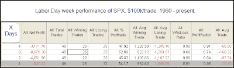
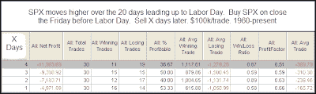

<!--yml
category: 未分类
date: 2024-05-18 13:14:19
-->

# Quantifiable Edges: Labor Day Week Edges

> 来源：[http://quantifiableedges.blogspot.com/2009/09/labor-day-week-edges.html#0001-01-01](http://quantifiableedges.blogspot.com/2009/09/labor-day-week-edges.html#0001-01-01)

From a seasonality standpoint, Labor Day week has historically been a bit weak.

(click table to enlarge)

Tuesday through Thursday have shown risk/reward to favor the bears, though whether the market is up or down has basically been a coin toss. If we look at times like the present where the market has made gains in the weeks leading up to Labor Day, you’ll find the implication is a bit more bearish.

(click table to enlarge)

This isn’t the most compelling edge I’ve ever published, but for a study based primarily on seasonality, it’s not bad.