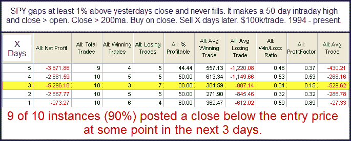

<!--yml
category: 未分类
date: 2024-05-18 12:53:42
-->

# Quantifiable Edges: Large Gap-n-Go Formations to New Highs Revisited

> 来源：[http://quantifiableedges.blogspot.com/2010/09/large-gap-n-go-formations-to-new-highs.html#0001-01-01](http://quantifiableedges.blogspot.com/2010/09/large-gap-n-go-formations-to-new-highs.html#0001-01-01)

Friday saw the SPY gap up strongly and then never look back.  The gap never filled and it closed well above the open.  In the

[10/15/09 blog](http://quantifiableedges.blogspot.com/2009/10/large-gap-gos-to-intermediate-term.html)

I looked at these type of situations when the market also made a 50-day high. I’ve updated that study below.

Instances are low here but the results are strong enough for me to take them under consideration.

*Edit: This post appears not to have made it out at the desired time (almost a day late to my RSS feed).  I am using a new blogspot editor and will look into what may have caused this.  Apologies.*

