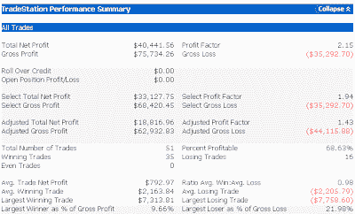
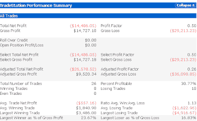

<!--yml
category: 未分类
date: 2024-05-18 13:24:15
-->

# Quantifiable Edges: Large Gaps Up After The Market Has Already Risen

> 来源：[http://quantifiableedges.blogspot.com/2009/04/large-gaps-after-market-has-already.html#0001-01-01](http://quantifiableedges.blogspot.com/2009/04/large-gaps-after-market-has-already.html#0001-01-01)

The S&P futures are up over 2% as I type

[. Last week I took a look at large gaps higher since September 2008](http://quantifiableedges.blogspot.com/2009/03/large-gaps-up-since-september-2008.html)

. Generally the result was the larger the gap up the better the market performed that day.

Not all gap formations are equal, though. It can also be important to consider the state of the market prior to the gap. When the market is already extended up the chances of a reversal down are much higher. One simple way to define an “extended” market would be to say if it has closed higher the last 2 days it is extended. Now let’s look at some test results. All tests were run on the SPY over the last 10 years. Results are based on $100,000 per trade.

The 1st study looks at buying at 1 minute past the open on a day where the SPY gapped up 1% and selling at the 4pm market close. In these cases the SPY had NOT risen the last 2 days in a row:

(click to enlarge)

As you can see the results are clearly bullish. Over 2/3 of the trades were profitable and winners were about the same size as the losers.

Now let’s look at the results of buying such 1%+ gaps when the market has already risen 2 days in a row:

(clck to enlarge)

Results are flipped here as we now have over 2/3 of the trades as losers. Again winners and losers are about the same size. The solid bullish tendency has switched to solidly bearish.

For those interested below are all of the instances of the 2nd (bearish) test.

(click to enlarge)