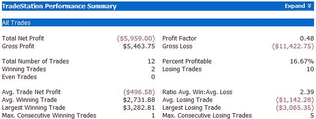
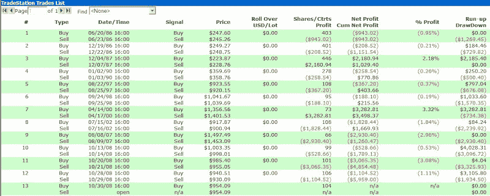

<!--yml
category: 未分类
date: 2024-05-18 13:34:59
-->

# Quantifiable Edges: Late-Day Market Surges

> 来源：[http://quantifiableedges.blogspot.com/2008/10/late-day-market-surges.html#0001-01-01](http://quantifiableedges.blogspot.com/2008/10/late-day-market-surges.html#0001-01-01)

For the 2nd day in a row the S&P 500 saw a sizable move in the last 10 minutes of the day. This time, though it was to the upside as the index gained nearly 1% from 3:50 to 4pm. We saw yesterday an example of how overly strong reactions are many times overreactions. Tonight I looked at the sharp upside reaction as opposed to last night’s downside reaction.

***SPX rises at least 0.75% in the last 10 minutes of the day. Buy on close. Sell at the next days close. $100k/trade. Last 25 years:*** ******

Ten out of 12 finished lower the next day. Below is a listing of all the trades:

The last 5 have been especially harsh.

As a commenter pointed out yesterday, overreactions haven’t been limited to intraday bars lately. To add to that, I would say almost every move the market has made in this highly charged environment has been an overreaction. It has in fact created vicious whipsaws in both directions for intraday and swing style traders.