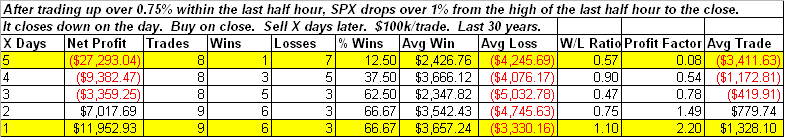

<!--yml
category: 未分类
date: 2024-05-18 13:23:13
-->

# Quantifiable Edges: Late Day Reversal Flips S&P To Negative

> 来源：[http://quantifiableedges.blogspot.com/2009/04/late-day-reversal-flips-s-to-negative.html#0001-01-01](http://quantifiableedges.blogspot.com/2009/04/late-day-reversal-flips-s-to-negative.html#0001-01-01)

We’ve seen before how strong end-of-day selloffs are often an overreaction. Frequently this means a bounce back over the next day or so. Tonight I looked at the below situation, which describes Wednesday's action:

Instances are low, but the results are interesting. The pattern is a sharp bounce followed quickly by another drop lower. Of the 9 instances, 8 of them closed

*higher*

than the entry trigger at some point in the next 3 days. Amazingly, 7 of 9 closed

*lower*

than the entry trigger within 4 days. Looking out 6 days would move the number to 8 of 9 and if you give it 6 days, then all 9 instances closed lower at some point. What I see is a propensity for violent chop over the next few days.