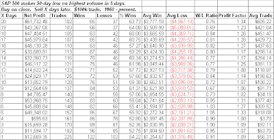
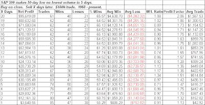
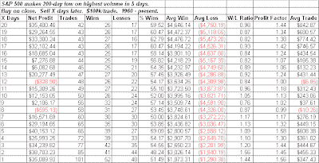
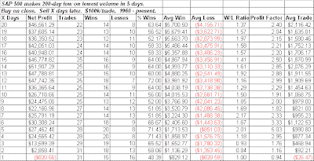
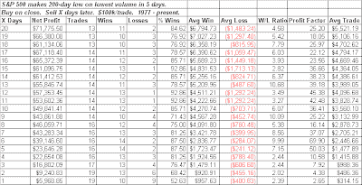

<!--yml
category: 未分类
date: 2024-05-18 13:26:09
-->

# Quantifiable Edges: Light Volume Bottoms Study Part 2

> 来源：[http://quantifiableedges.blogspot.com/2009/03/light-volume-bottoms-study-part-2.html#0001-01-01](http://quantifiableedges.blogspot.com/2009/03/light-volume-bottoms-study-part-2.html#0001-01-01)

In

[the March 6th blog](http://quantifiableedges.blogspot.com/2009/03/can-market-bottom-on-light-volume.html)

I showed a study that looked at 50-day lows occurring on heavy volume (highest in 5 days) and light volume (lowest in 5 days). A 50-day low on light volume was found to be significantly more bullish. On Monday the market made a new low on the lightest volume in 5 days.

Unfortunately when I went through some of those studies Monday night I realized something quirky was happening in Tradestation. I had run them using imported volume data that went back to 1992\. I also ran them on the Tradestation volume data from 1992 – present. I did this to check and see that the sets were similar. Upon finding they were I removed the 1992 – present restriction and looked back from 1960 – present. When I did that for some reason the tests ran improperly and they continued to only look back as far as 1992\. There’s good news and bad news associated with this. The bad news is that when looking back further the numbers aren’t quite as enticing. The good news is that with a larger data set I was able to examine 200-day lows as well.

So here are the 50-day low numbers all the way back to 1960\. First looking at high volume:

(click on any table to enlarge)

Still an edge, although a bit weaker from an Avg Trade standpoint. The last 16 years or so that were looked at last week have done better than the long-term average.

Now let’s look at low volume.

The edge here again isn’t nearly as pronounced when looking across the longer period as it was from 1992 – present. It is still quite a bit better than the high volume scenario though.

With the added data I was able to run 200-day moving average data back to 1960 as well. Again I’ll show the high volume scenario first:

Not much of an edge here. Perhaps a slight upside tendency. Next is again the low volume setup, but now using the 200-day low.

Here the edge appears fairly solid. When I looked at it in more detail I found that the bullish edge really began to exert itself around 1977\. Below is a test only going back that far:

Instances are a little light but the results here are very strong.