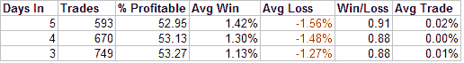
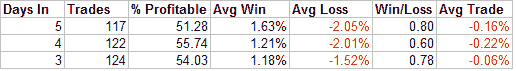

<!--yml
category: 未分类
date: 2024-05-18 08:30:12
-->

# Quantifiable Edges: Light Volume Pullback (A Good Thing?)

> 来源：[http://quantifiableedges.blogspot.com/2008/03/light-volume-pullback-good-thing.html#0001-01-01](http://quantifiableedges.blogspot.com/2008/03/light-volume-pullback-good-thing.html#0001-01-01)

The standard line on days like Wednesday goes something like this:

*The S&P 500 pulled back today on light volume. After the recent run-up the market was due to pull back. The light volume is a sign that selling was not aggressive and should be viewed as a positive. The pullback appears orderly. It would seem buyers just stepped away. There doesn’t appear to be any heavy institutional distribution.* 

Does any of the above sound familiar? It seems to make sense. Everyone claims they want the market to pull back on light volume. It’s in plenty of books so it must be true. Hmm…

I ran some tests on the S&P 500 looking for the following conditions:

1) Yesterday the 3-period RSI was above 70 (showing there has been a short-term run-up).

2) Today the market closed lower than yesterday.

Buy at the close. Sell “X” days later. Over the last 25 years here is what the S&P 500 has done 3,4, and 5 days out after this setup:

Over the next 3-5 days the market has managed very slight gains.

Next I added a 3rd condition to the mix:

3) Volume must be the lowest volume of the last 10 days.

Again I’m buying at the close and selling “X” days later. Over the last 25 years here is what the S&P 500 has done 3,4, and 5 days out after this setup:

Apparently the “buyers stepped away” on day 1\. Over the next few days the sellers filled the void. Very light volume at the beginning of a pullback does NOT appear to be a good thing.

Another myth busted.