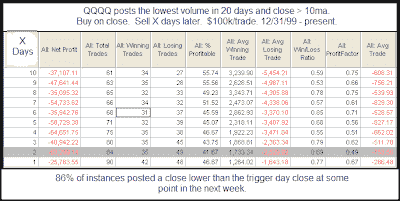

<!--yml
category: 未分类
date: 2024-05-18 13:18:28
-->

# Quantifiable Edges: Low QQQQ Volume In an Uptrend Revisited

> 来源：[http://quantifiableedges.blogspot.com/2009/06/low-qqqq-volume-in-uptrend-revisited.html#0001-01-01](http://quantifiableedges.blogspot.com/2009/06/low-qqqq-volume-in-uptrend-revisited.html#0001-01-01)

Friday night

[the Quantifinder](http://www.quantifiableedges.com/quantifinderinfo.html)

identified the below study. I

[haven't updated it in over a year](http://quantifiableedges.blogspot.com/2008/04/is-buying-drying-up.html)

so I thought it would be interesting to do so.

Results are much the same as they were a year ago. Low QQQQ volume in an uptrend has often signalled at least a short-term drying up of buying interest. Historically this has created negative expectations over the next several days and weeks.

Much of the net negative thrust has often been found in the 1st two days following the setup.