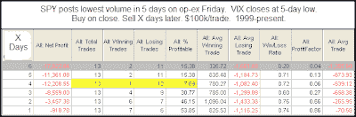

<!--yml
category: 未分类
date: 2024-05-18 13:17:44
-->

# Quantifiable Edges: Low SPY Volume & Low VIX on Options Expiration

> 来源：[http://quantifiableedges.blogspot.com/2009/07/low-spy-volume-low-vix-on-options.html#0001-01-01](http://quantifiableedges.blogspot.com/2009/07/low-spy-volume-low-vix-on-options.html#0001-01-01)

I was on vacation last week with limited access to the internet. While subscribers still got the nightly Subscriber Letter, I was unable to produce blogs. I’m back now and will have some edges to share this week. This is one study I found interesting from Sunday night’s Subscriber Letter.

(click to enlarge)

Pretty much everything I’m looking at short-term is suggesting a pullback. Longer-term that is not the case.