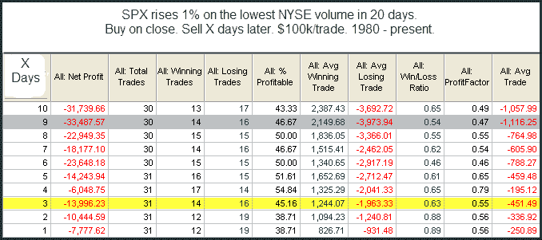

<!--yml
category: 未分类
date: 2024-05-18 13:13:06
-->

# Quantifiable Edges: Low Volume When The Market Rises Strongly

> 来源：[http://quantifiableedges.blogspot.com/2009/09/low-volume-when-market-rises-strongly.html#0001-01-01](http://quantifiableedges.blogspot.com/2009/09/low-volume-when-market-rises-strongly.html#0001-01-01)

I showed yesterday how a very-low volume day during a decline can often lead to a short-term reversal. Today I will review a study that first appeared in the blog on 5/13/2008\. It looks at extremely low volume on strong up days - like Monday. (Volume studies typically use the symbol $TVOL in Tradestation, which is their measure of NYSE volume. This is what is being used in the below study.)

We’ve seen several studies like this over time and many of them were identified by the

[Quantifinder](http://quantifiableedges.blogspot.com/2009/05/quantifinder-unveiled.html)

on Monday. With so many studies confirming each other, it seems the downside edge in these very low volume rises is for real. One caveat with Monday’s action though is that it was Yom Kippur, meaning a lot of traders were out of action and somewhat lower volume could be expected. Still, it’s been a steady enough edge that I decided to it was worth review.