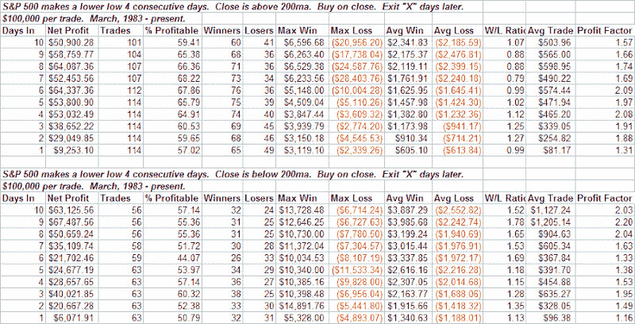

<!--yml
category: 未分类
date: 2024-05-18 08:18:10
-->

# Quantifiable Edges: Lower Lows

> 来源：[http://quantifiableedges.blogspot.com/2008/05/lower-lows.html#0001-01-01](http://quantifiableedges.blogspot.com/2008/05/lower-lows.html#0001-01-01)

The S&P and Dow have both seen some choppy action over the last week. Each of the last 4 days has been a reversal of the previous day’s direction. Up, down, up, down, up. What’s unusual about the chop is that is has been accompanied by 4 lower lows in the indices (Dow and S&P). In Larry Connors “How Markets Really Work”, he demonstrates that an edge typically exists when the market makes a series of lower lows or higher highs. The edge is in the opposite direction. In the book he also breaks it down by whether the market is trading above or below the 200-day moving average. In my own work I have found the concept of looking at consecutive lows or highs helpful as well.

Let’s look at some statistics based on how the market has performed in the past after a series of at least 4 lower lows. I’ll then offer some opinion on how it translates to our current situation.

A few things to note in the above tables:

The chance of seeing a bounce is greater when you are above the 200ma than when you are below. Over the period tested it’s in the range of 57%-67% above and 44%-60% below. In either case the market is generally more likely to rise over the next 1-10 days.

The average loss is slightly larger when under the 200ma. The difference would be skewed quite a bit more in the favor of the “greater than 200ma” bucket if not for the “max loss” outlier. The unusually large loss above the 200ma came courtesy of the Crash of ’87\. (Which incidentally was not included in Connors book since those tests only ran to 1989.)

The average win below the 200ma is nearly twice the size of the average win above the 200ma for most time periods looked at. For those wondering why this is, think “short-covering rally” and increased volatility. Both trademarks of long-term downtrends.

Even with the increased chance of a bounce above the 200ma, the expected value (avg trade) is greater below the line. This would remain true even if you were to eliminate the “worst trade” from the upper bucket.

This study suggests an upside edge over the next few days. Before getting too excited though it may be worth considering what we just learned in the context of the current market situation. Yes, we’ve pulled back 4 days in a row, but although the market is below its 200 day moving average, volatility remains relatively low. The chance of short-covering helping to fuel a bounce seems muted as well since the market has been rallying already for a month and a half. Based on these facts, I would reduce the expected potential reward from the “under 200 ma” level to the “over 200ma level”. The chance of a bounce actually materializing I might put somewhere in between the two buckets. There has been a series of higher lows and the market is in an uptrend, but it isn’t quite a healthy sustained rally just yet.

Overall, I believe the study suggests a positive expectation over the next few days – just not one that is as large as it first might appear when glancing at the tables.