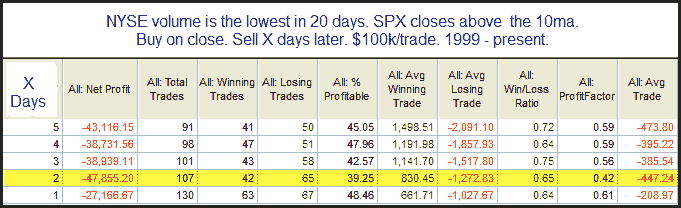
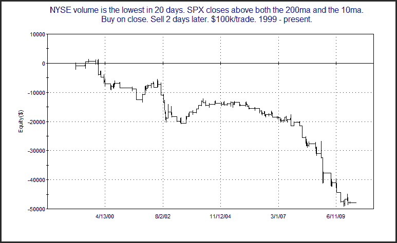

<!--yml
category: 未分类
date: 2024-05-18 13:02:36
-->

# Quantifiable Edges: Lowest Volume In Over A Month Suggesting a Pullback

> 来源：[http://quantifiableedges.blogspot.com/2010/03/lowest-volume-in-over-month-suggesting.html#0001-01-01](http://quantifiableedges.blogspot.com/2010/03/lowest-volume-in-over-month-suggesting.html#0001-01-01)

I’ve noted before how extremely low volume during an upmove can lead to a pullback. Below is a study the Quantifinder identified from the 11/16/09 weekly subscriber letter.

Implications seems to be that there is a downside edge over the next few days – especially days 1 and 2\. Below is an equity curve using a 2-day exit strategy.

