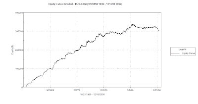
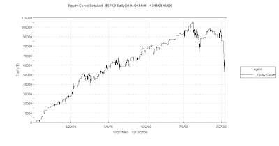

<!--yml
category: 未分类
date: 2024-05-18 13:31:46
-->

# Quantifiable Edges: Market Performance In Relation To The 50 & 10-day MA's

> 来源：[http://quantifiableedges.blogspot.com/2008/12/market-performance-in-relation-to-50-10.html#0001-01-01](http://quantifiableedges.blogspot.com/2008/12/market-performance-in-relation-to-50-10.html#0001-01-01)

This chart is very similar to the same quadrant when looking at the 200/50 test. Good follow through was seen when the market was near its highs up until about 1988\. From 1988-2000 the edge was weaker. Post 2000 is has been non-existent. Even the latest bull market from 2003-2007 failed to make much headway when trading above these two lines. I noted a few weeks ago that bull market saw little in the way of enthusiasm near highs and this is more proof of that.

The next chart shows performance after the S&P closes above the 50 but below the 10-day moving average.

During the 60’s and 70’s this was not a place to be buying. Since the late 80’s this quadrant has generated some nice returns. The shape here is again somewhat reminiscent of the 200/50 chart of the same quadrant.

Now quadrant 3 – Similar to 2 weeks ago this is where the market has spent the least amount of time.

Again somewhat similar to the last test. This quandrant has done fairly well historically – mostly as the market emerges from below. The last two bear markets have seen some steep losses from this area, though.

Lastly a look at trading below both the 50 and 10-day moving averages:

During the 60’s and 70’s this quadrant consistently lost money. Since the mid-80's pullbacks into this quadrant have often been buying opportunities. It has suffered during the last 2 bear markets. This suggests you're beter of attempting longs in this quadrant during a bull market.

A few quick observations to take from the above:

1) Whether using the longer 200/50 moving averages or the 50/10 moving averages the results look fairly similar.
2) It’s been a good 10 years since chasing strength worked and a good 20 since it’s worked well.
3) Pullbacks in uptrends have provided the best long-side opportunities over the last 20 years.
4) During vicious bear markets like the current one, buying below the 50-day moving average can be a difficult and dangerous endeavor. (See quadrants 3 & 4.)

-------------------------------------------------------------------------

I've had some inquiries lately about people looking to purchase an annual

[Gold](http://www.quantifiableedges.com/gold.html)

or

[Silver](http://www.quantifiableedges.com/silver.html)

subcription as a holiday gift. One concern has been timing in that they didn't want the subscription to run out too early. Therefore, I've decided any new 1-year subscriptions purchased between now and 12/31 will automatically run through 12/31/2009\. (You may

[click here](http://www.quantifiableedges.com/meminfo.html)

for a features breakdown.)