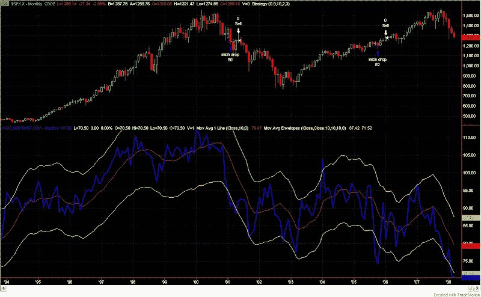

<!--yml
category: 未分类
date: 2024-05-18 08:31:20
-->

# Quantifiable Edges: Markets Fearful, Consumers Depressed

> 来源：[http://quantifiableedges.blogspot.com/2008/03/markets-fearful-consumers-depressed.html#0001-01-01](http://quantifiableedges.blogspot.com/2008/03/markets-fearful-consumers-depressed.html#0001-01-01)

I had a lot of studies I was considering conducting tonight. Certain readings of fear hit new levels on Friday. The VIX closed at it highest closing level since March of 2003 on Friday. The spike up put it about 15% above its 10-day moving average. The CBOE equity put/call ratio hit an all-time high of 1.16\. The CBOE Total Put/Call Ratio closed at 1.40\. Extreme reading in all these numbers are not worth testing tonight. They are likely to all get more extreme tomorrow. With Bear Stearns being taken over for $2/share (down about 97% from Thursday) by JP Morgan the S&P Futures are down about 3% tonight and have traded below their January lows.

This should make for some interesting and exciting trading over the next few days. With this kind of gap down, my intraday trading will likely focus on the long side. On Monday or Tuesday I may be able to produce some studies that could have short-term significance, but tonight let’s look longer-term.

An extreme reading on Friday that went largely ignored due to Bear was the Michigan Consumer Sentiment Index. It came in at 70.5, which was the lowest reading in 16 years. Since this won’t change tomorrow morning I figured I would play around with that data a little.

Below is a chart. The top shows the S&P 500 and the bottom the Michigan Consumer Sentiment Index (blue). The red line is a ten period moving average of the index and the yellow lines are 10% bands of the 10-period moving average.

As you can see the drop in sentiment has been sharp and fairly steady over the last year. It has now closed below its lower 10% band for two months in a row. I ran a test to see how the market has performed when this has occurred in the past going back to 1/1/78 – which is as far as I have the Consumer Sentiment data. Results are below.

Looking out 9 and 12 months the only loser was the 2001 instance. In this case the sharp drop in consumer sentiment was still posting readings over 90\. In the other 4 cases, all of which led to higher prices 9 and 12 months later, the index dropped below 75\. This suggests things aren’t normally as bad as they seem. Hopefully that holds true this time. I especially hope it holds true for the employees and families directly affected by the Bear Stearns debacle.

Interestingly (and thankfully) the CBI did not budge Friday. It remains at 2\. That could change dramatically in the next few days if a full-blown panic sets in.