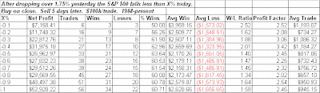

<!--yml
category: 未分类
date: 2024-05-18 13:27:30
-->

# Quantifiable Edges: Mild Selloff After Sharp Drop Sets Up S&P For A Bounce

> 来源：[http://quantifiableedges.blogspot.com/2009/02/mild-selloff-after-sharp-drop-sets-up-s.html#0001-01-01](http://quantifiableedges.blogspot.com/2009/02/mild-selloff-after-sharp-drop-sets-up-s.html#0001-01-01)

In the past

[I’ve found that weak bounces after strong selloffs](http://quantifiableedges.blogspot.com/2009/01/weak-bounce-not-encouraging.html)

have had bearish short-term implications. Wednesday’s action just missed the weak bounce as the S&P finished marginally lower. So tonight I looked at S&P performance following a sharp drop and then a marginally lower day. Below I show the 5-day return across a spectrum of possible % declines between 0 and X%.

(click to enlarge)

Rather than the bearish results found when the market undergoes a weak bounce, we see here that limited additional selling carries a bullish expectation over the following week. The edge remains fairly consistent regardless the level of decline between 0% and 1%.