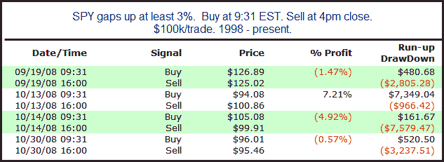

<!--yml
category: 未分类
date: 2024-05-18 13:00:27
-->

# Quantifiable Edges: Monster Gaps Higher

> 来源：[http://quantifiableedges.blogspot.com/2010/05/monster-gaps-higher.html#0001-01-01](http://quantifiableedges.blogspot.com/2010/05/monster-gaps-higher.html#0001-01-01)

As of now the market is gapping up very strongly on bailout news. SPY is up over 4% as I type. I looked back to find other instances of monster gaps and how the market behaved on those days. For this study I required the gap to be at least 3%. Results below.

Only 4 instances make it dangerous to draw any solid conclusions. I'll let readers do their own interpretations. I would note that all 4 instances took place in September or October of 2008.