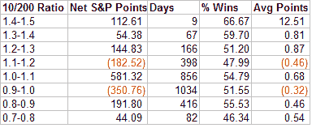

<!--yml
category: 未分类
date: 2024-05-18 13:42:37
-->

# Quantifiable Edges: More Detail On Put/Call Ratios

> 来源：[http://quantifiableedges.blogspot.com/2008/08/more-detail-on-putcall-ratios.html#0001-01-01](http://quantifiableedges.blogspot.com/2008/08/more-detail-on-putcall-ratios.html#0001-01-01)

[Last week I looked at some moving averages of the CBOE Put/Call ratio](http://quantifiableedges.blogspot.com/2008/07/what-recent-putcall-ratios-are.html)

. I compared the 10-day average to the 200-day average. The 10-day average gives a sentiment snapshot for option traders. The ratios have risen gradually over the years as the market has evolved. The 200-day average helps to normalize the 10-day readings.

What was shown last week is that when the 10-period moving average is below the 200-period average, the market over time has lost money. When the 10-period moving average has been above the 200-period moving average, the net results over time have been a gain.

I decided this week to take a closer look. As it turns out, the results are not quite as cut and dry as they may appear at first. I used the same time period so that the numbers would match up. The column on the left shows the 10ma/200ma ratio. Returns are broken down by range. For example, on July 25th the 10-day average of the CBOE total put/call ratio was 0.96\. The 200-day average was 1.03\. Dividing the 10 (0.96) by the 200 (1.03) gives a result of about 0.93\. Therefore, July 25th would have fallen into the 0.9 – 1.0 category. Points gained and lost are totals for the day

*following*

the reading.

I found these results quite interesting in a few ways. First, ratios just below 1 were bearish while times when the 10ma was strongly below the 200ma actually resulted in gains. I suspect this is due to the fact that the extremely low readings may be the result of a strong move to the upside. Strong moves up are more likely to continue up than weak ones.

Also interesting is the fact that 1.1 – 1.2 shows a negative return going forward. I suspect at this point the market may often be downtrending. Readings higher than this could signal exhaustion, which is why they results in positive days going forward.

An uptrending market with a little skepticism (1.0-1.1 reading) may be the sweet spot when looking for long-term gains.

While in general you'd rather see some skepticism with a ratio greater than 1, it’s not quite as simple as saying greater than 1 is good and less than 1 is bad.