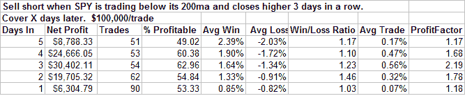

<!--yml
category: 未分类
date: 2024-05-18 08:30:20
-->

# Quantifiable Edges: More Evidence Suggesting A Short-Term Pullback And Implications If It Doesn't

> 来源：[http://quantifiableedges.blogspot.com/2008/03/more-evidence-suggesting-short-term.html#0001-01-01](http://quantifiableedges.blogspot.com/2008/03/more-evidence-suggesting-short-term.html#0001-01-01)

Last night I showed a couple of studies that suggested the market was likely to begin a pullback or at least a consolidation in the next few days. Tonight I’ll review and remake some past studies.

Tuesday was an inside day for the S&P 500\. (Lower high and higher low on the chart.)

[On February 10th](http://quantifiableedges.blogspot.com/2008/02/why-inside-days-get-me-down.html)

, I discussed inside days with down closes. Tuesday closed higher so it didn’t quite qualify under that study. Looking at all inside days in SPY going back to the beginning of 2001 I uncovered the following:

There have been 215 inside days in SPY since 1/1/2001.

116 times (54%) the market closed LOWER the next day.

The average loss the next day was 0.9%.

The average gain the next day was 0.6%.

The net average move the next day was a 0.2% loss.

I then looked at inside days when the market had made a short-term move up and was at or approaching overbought. For this I required the 3-period RSI to be 70 or greater. This led to the following results:

There have been 48 inside days in SPY since 1/1/2001 with the 3-period RSI closing above 70.

29 times (60%) the market closed LOWER the next day.

The average loss the next day was 0.55%.

The average gain the next day was 0.37%.

The net average move the next day was a 0.2% loss.

The second concept I discussed recently which is once again popping up is

[consecutive higher closes in a long-term downtrend](http://quantifiableedges.blogspot.com/2008/02/count-to-three.html)

. Below are the results of selling short the SPY any time it closes higher 3 days in a row while under its 200 day moving average.

More and more evidence is starting to point at a likely pullback. Still, caution is warranted. The market just posted a Follow Through Day. Past Follow Through Days have also typically led to short-term overbought conditions. This did not lead to a downside edge over the short-term. Readers may want to review

[my Feb. 1st column](http://quantifiableedges.blogspot.com/2008/02/short-term-implications-of-follow.html)

for more details on this. Also in the Feb. 1st column I show how the first week following a Follow Through Day has predicted the success or failure of the rally about 2/3 of the time. Traders may want to keep this in mind and pay special attention to the action over the next few days.

In short, a pullback now appears more likely than not. Should the market fail to pull back over the next few days that would suggest positive implications for the intermediate-term.