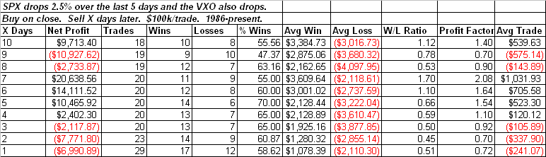

<!--yml
category: 未分类
date: 2024-05-18 13:26:43
-->

# Quantifiable Edges: My Take On The VIX

> 来源：[http://quantifiableedges.blogspot.com/2009/03/my-take-on-vix.html#0001-01-01](http://quantifiableedges.blogspot.com/2009/03/my-take-on-vix.html#0001-01-01)

Another big day down today and still the VIX isn’t stretched. An observation I’ve seen several traders make is that while the S&P fell hard last week, the VIX (and VXO) didn’t rise. The interpretation by some is that this suggests a lack of fear and is short-term bearish. I was unable to find evidence to support this theory. Below is one test I ran that looked at other times the S&P fell at least 2.5% while the VXO also fell.

I wouldn’t call the results bullish but I wouldn’t call them bearish either. I would suggest that perhaps the VIX is simply an indicator lacking a solid edge for the time being.