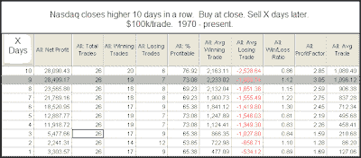
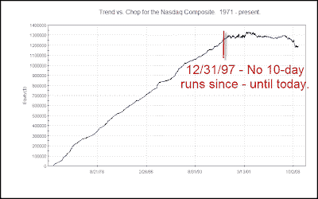

<!--yml
category: 未分类
date: 2024-05-18 13:17:19
-->

# Quantifiable Edges: My Take On the Nasdaq Streak

> 来源：[http://quantifiableedges.blogspot.com/2009/07/my-take-on-nasdaq-streak.html#0001-01-01](http://quantifiableedges.blogspot.com/2009/07/my-take-on-nasdaq-streak.html#0001-01-01)

The Nasdaq’s winning streak reached 12 on Thursday. It's all over the news. In Tuesday night's Subscriber Letter, when the streak had hit 10, I posted the following commentary. I think you may find my take a bit different than others who have examined the streak.

*I have seen much written about the Nasdaq’s current winning streak. As of Tuesday the Nasdaq has now closed higher for 10 days in a row. I ran a study to examine performance following such runs since the inception of the Nasdaq.* *(click table to enlarge)

*

These results appear to be quite bullish. Rather than just taking them at face, though, let’s give it some further thought and consideration. A closer examination of the results would show that the last occurrence was in 1997, which means it happened 26 times in 26 years and then not again for 12 years. Let’s consider what might cause this to happen and what this suggests about the above results. I’ve shown the Trend vs. Chop chart many times for the S&P 500, but never for the Nasdaq Composite. I decided to produce that for examination below. As a quick refresher, a downward moving line suggests the market is dominated by chop while an upward trending line suggests daily follow through is more prevalent.

For those who would like to read more on the Trend vs. Chop concept you may [click here](http://quantifiableedges.blogspot.com/search/label/Trend%20Vs.%20Chop).***

*As you can see the Nasdaq saw a strong and steady tendency to follow through on a day to day basis during the 70’s, 80’s and much of the 90’s. Strong follow through means that strength suggests more strength. Therefore, the fact that the results were bullish over the 1971-1997 period shouldn’t come as a surprise. From a Trend vs. Chop perspective the nature of the market is so different today than it was during that period, that I don’t think it would be reasonable to extrapolate the results of the above test to the current environment. This essentially means that there is no historical precedent for 10 consecutive up days in a choppy trading environment...* My inclination was that in a mean-reverting environment, results would likely be worse than those above. To this point that hasn’t proven to be the case. I’m still expecting some short-term weakness, though.*