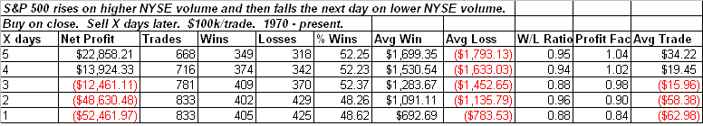
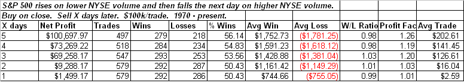
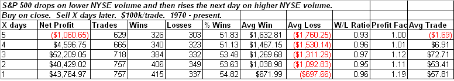
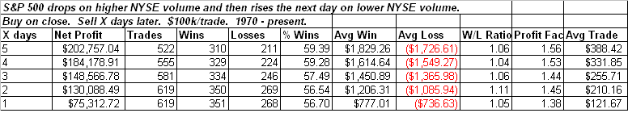

<!--yml
category: 未分类
date: 2024-05-18 13:21:48
-->

# Quantifiable Edges: Mythbusting Some 2-day Volume Patterns

> 来源：[http://quantifiableedges.blogspot.com/2009/05/mythbusting-some-2-day-volume-patterns.html#0001-01-01](http://quantifiableedges.blogspot.com/2009/05/mythbusting-some-2-day-volume-patterns.html#0001-01-01)

On Thursday the market dropped on rising volume. On Friday it rose on lower volume. I can’t tell you the number of times I’ve read that this pattern is bearish. The classic line of thinking suggests that you want the market to rise on higher volume and drop on lower volume. Therefore many technicians have a habit of looking at any 2-day period such as Thursday & Friday and automatically determining good or bad based on what day the volume rose and what day it dropped. If it had fallen on lower volume and risen on higher volume you’d undoubtedly be able to find someone writing about how that was a bullish volume pattern. Let’s take a look at some 2-day volume patterns to assess the validity of such analysis.

There are 4 simple patterns I looked at for this study:
*1) Up day on up volume followed by down day on down volume.
2) Up day on down volume followed by down day on up volume.
3) Down day on down volume followed by up day on up volume.
4) Down day on up volume followed by up day on down volume.* 
Before viewing the results, to give you some context, the average day over the test period gained about 0.03%, or $30\. Now let’s look at the 1st scenario first.

So you have a strong move higher followed by a light volume pullback. Based on the overly-simple classic analysis this would seem to be a very positive pattern. In fact over the following three days there has had a negative implication, and looking out 1 week there is still a strong underperformance vs. a typical 5-day period.

Keeping the same price pattern and flipping the volume pattern we get scenario #2 above. This would often be looked at as a negative volume pattern. Let’s look and compare it to #1.

The price pattern still underperforms over the 1st 2 days, but it’s made up for by the end of the week. All of the expectations are net positive and the results are much stronger than scenario #1\. This may come as quite a surprise to most people.

So now let’s move on to scenario #3\. Here we have a down day followed by and up day with a “classically bullish” volume pattern.

Not seen above is that while net expectations do turn positive again starting on day 6, they still are the worst of the 4 scenarios even looking 2 weeks out.

Lastly, let’s look and compare the 4th scenario to the 3rd. This last scenario is the one we saw on Thursday and Friday – a down move on higher volume followed by rebound on lighter volume. Traditional analysis would suggest this is worse than scenario #3…

Traditional analysis would again fail here. In fact this was the most bullish 2-day pattern of the bunch.

Of further note I actually ran the tests out as far as 2 weeks. The end results were all the same as above so I didn't feel the need to show that much data.

While I didn’t take much stock in this kind of simple volume analysis before the study, I was quite surprised to find the results were so strongly in opposition to what is commonly believed.

A couple of quick parting thoughts:

1) Don’t be sucked in to believing that up volume on up days and down volume on down days is necessarily a bullish pattern. Also down volume on up days and up volume on down days aren’t necessarily bearish. There’s a lot of misinformation out there and the real answer may be much more complex.

2) This doesn’t mean volume isn’t a useful tool. I’ve found it especially useful at extremes. Traders who would like to sample some ways in which volume can be used to create an edge can check out the past volume studies by [clicking here](http://quantifiableedges.blogspot.com/search/label/volume) or using the volume label on the right hand side of the blog.