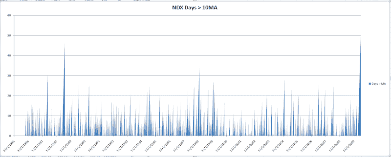

<!--yml
category: 未分类
date: 2024-05-18 13:01:13
-->

# Quantifiable Edges: NDX Closes Above 10ma for 50 Days In A Row - 1st Time Ever

> 来源：[http://quantifiableedges.blogspot.com/2010/04/ndx-has-now-had-remarkable-streak-of-50.html#0001-01-01](http://quantifiableedges.blogspot.com/2010/04/ndx-has-now-had-remarkable-streak-of-50.html#0001-01-01)

The NDX has now had a remarkable streak of 50 closes above the 10ma. That’s over 2 months without even a mild pullback. This is the longest streak since the index’s inception in 1986\. Below is a chart that shows the number of days the NDX has spent above it 10ma at any point in time.

(click chart to enlarge)

It’s a little difficult to read when try to jam so much history into a small area, but the spike on the right is the current count and it is up to 50\. The previous high lasted 47 days in 1989.

In last night’s Subscriber Letter I also discussed research associated with long streaks in the Dow (now at 48 days) and S&P (recently ended at 42 days). The general finding was that such persistent upmoves have a very strong tendency to continue up after the 1st pullback occurs. Rarely will you see an abrupt end to these kind of moves.

If you’d like to see that research then you may take a free trial

[by clicking here](http://www.quantifiableedges.com/members/register.php)

. If it’s been more than 6 months since your last trial you may email me at support @ quantifiable edges.com (no spaces) and I’ll be happy to set you up with one.