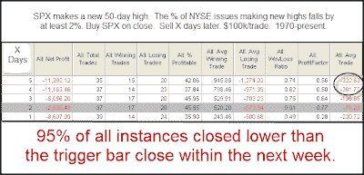

<!--yml
category: 未分类
date: 2024-05-18 13:17:11
-->

# Quantifiable Edges: NYSE New Highs Contract While SPX Makes 50-day High

> 来源：[http://quantifiableedges.blogspot.com/2009/07/nyse-new-highs-contract-while-spx-makes.html#0001-01-01](http://quantifiableedges.blogspot.com/2009/07/nyse-new-highs-contract-while-spx-makes.html#0001-01-01)

Also notable from Friday afternoon is the fact that new highs contracted substantially while the S&P made a 50-day high. The percentage of stocks hitting new 52 week high dropped from a little over 7% on Thursday to under 5% on Friday. I looked at other times the SPX made a 50-day high while the drop in new highs equaled 2% or more of the total issues.

(click image to enlarge)

What I found interesting and compelling about the above test was NOT the size of the average decline. In fact that was somewhat weak. It was the fact that 95% of instances closed below the trigger day close at some point in the next 5 days. This suggests that while the lagging new highs might not indicate an immediate selloff, the market has consistently struggled to move higher.