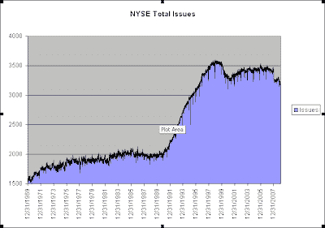

<!--yml
category: 未分类
date: 2024-05-18 13:27:46
-->

# Quantifiable Edges: NYSE Total Issues Contracting

> 来源：[http://quantifiableedges.blogspot.com/2009/02/nyse-total-issues-contracting.html#0001-01-01](http://quantifiableedges.blogspot.com/2009/02/nyse-total-issues-contracting.html#0001-01-01)

One number that has been hitting low levels lately is the number of issues traded on the NYSE. The chart below goes back to 1970, which is as far back as my database goes. During the difficult economic environment during the 70’s the total issues crept higher without much in the way of sharp rises or falls. Following the crash of ’87 the total issues only suffered a mild setback. The 90's saw a rapid expansion in total issues. The 2000-2003 bear market saw a sizable contraction. In the last year there has been another fairly sharp contraction. With increased bankruptcies, floundering stock prices, and a dormant IPO market this number may continue to contract. A true economic expansion that could be accompanied by a multi-year bull market would likely see the IPO market revived and the NYSE total issues expand as well. I’d be wary of the sustainability of a bull market that saw continued contraction in the total issues traded on the NYSE.

(click to enlarge)

*P.S. It would be interesting to see how this chart would look in the 30’s and 40’s. I haven’t been able to locate that data yet. Should any blog readers know a resource I’d be happy to link to it.*