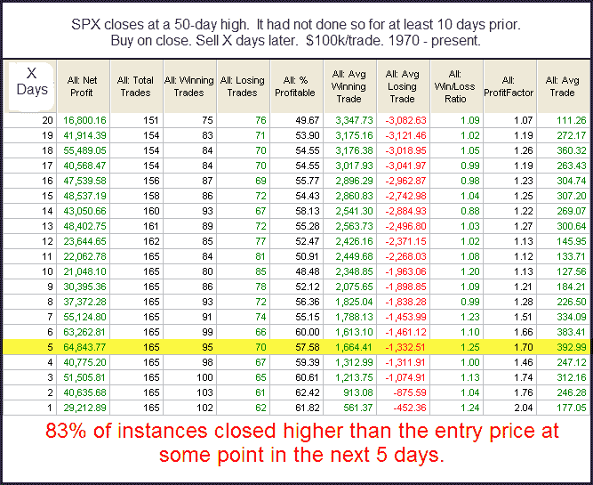
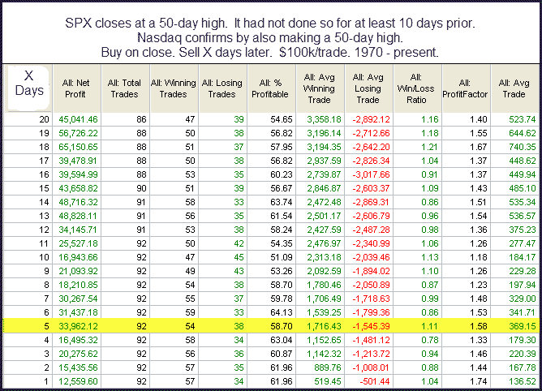

<!--yml
category: 未分类
date: 2024-05-18 13:08:36
-->

# Quantifiable Edges: Nasdaq Confirms S&P New High - Does It Matter?

> 来源：[http://quantifiableedges.blogspot.com/2009/12/nasdaq-confirms-s-new-high-does-it.html#0001-01-01](http://quantifiableedges.blogspot.com/2009/12/nasdaq-confirms-s-new-high-does-it.html#0001-01-01)

Below is some research from last night's

[Subscriber Letter](http://www.quantifiableedges.com/gold.html)

...

The S&P and Nasdaq set new closing highs Monday. They were the 1st closing highs since late November. Typically when the SPX breaks out to a new closing high after not making one for at least a couple of weeks, it leads to short-term follow through. I looked at this a few different ways – using both SPY and SPX and considering 50 and 200 day highs. All the results came out very similar. Below is one example.

I find it interesting that the while the breakout typically is accompanied by short-term follow through, it doesn’t carry over to the intermediate-term.

One thing I’m neglecting to look at in the above test is the fact that the Nasdaq also broke to a new closing high. Many traders might see this as “confirmation” of the S&P’s closing breakout. I decided to check and see how much difference the Nasdaq confirmation made.

These results are almost identical to the first test, though with a reduced sample size. I compared several ways and kept coming up with the same answer. The confirmation seems to be worthless. It neither greatly enhances nor greatly detracts from results. This holds true both short and intermediate-term. Frankly this was a bit surprising to me since we know

[a leading Nasdaq has been a good sign historically](http://quantifiableedges.blogspot.com/2009/05/simple-powerful-timing-indicator.html)

.