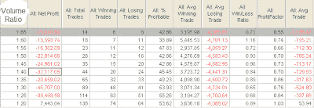

<!--yml
category: 未分类
date: 2024-05-18 13:19:45
-->

# Quantifiable Edges: Nasdaq/NYSE Volume Ratio Hitting Extreme Levels

> 来源：[http://quantifiableedges.blogspot.com/2009/06/nasdaqnyse-volume-ratio-hitting-extreme.html#0001-01-01](http://quantifiableedges.blogspot.com/2009/06/nasdaqnyse-volume-ratio-hitting-extreme.html#0001-01-01)

The Nasdaq/NYSE Volume Ratio is an indicator I haven’t discussed on the blog, and not too often in

[the Subscriber Letter](http://www.quantifiableedges.com/gold.html)

. It is hitting extreme levels at this time and deserves some attention. One word of caution - levels will vary depending on data provider. So while the extremes may differ depending on whose data you use, results should be comparable at those extremes. I use Tradestation. On Tuesday the Nasdaq/NYSE volume 20-day average closed over 1.65\. Below is a table showing 1-month returns based on this ratio.

***Nasdaq / NYSE 20-day volume ratio exceeds X. Buy S&P 500 on close. Sell 20-days later. $100k/trade. (click to enlarge)***

High levels of Nasdaq trading as opposed to NYSE suggest excessive speculation by investors. Once this level exceeds 1.4 (as Tradestation measures it), is has generally indicated a bearish bias.