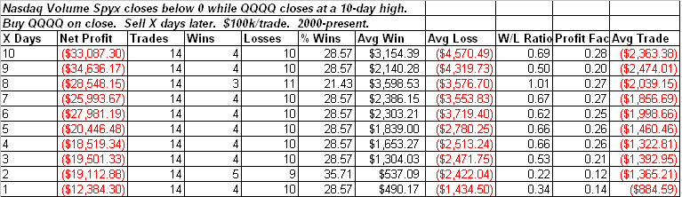
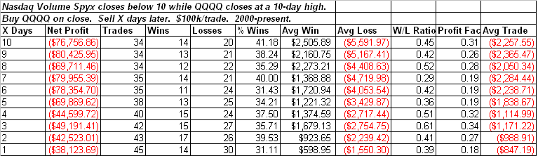

<!--yml
category: 未分类
date: 2024-05-18 13:20:01
-->

# Quantifiable Edges: Nasdaq New High & Low Volume Spyx Suggest Edge

> 来源：[http://quantifiableedges.blogspot.com/2009/06/nasdaq-new-high-low-volume-spyx-suggest.html#0001-01-01](http://quantifiableedges.blogspot.com/2009/06/nasdaq-new-high-low-volume-spyx-suggest.html#0001-01-01)

One notable statistic from Thursday’s action was the

[Quantifiable Edges Nasdaq Volume Spyx](http://quantifiableedges.blogspot.com/2008/11/introducing-volume-spyx.html)

indicator closed around minus 4\. (For those uninitiated my volume spyx indicators look at comparative volume across multiple securities. When ratios get out of whack, it often shows up as an upside or downside spike on the chart.) Closes below zero are rare and often lead to weakness over the next few days. This is especially so when the market rises along with the low readings. Below is a study that exemplifies this.

The number of occurrences is a bit low but certainly suggestive of a downside edge over the next several days. The edge appears the strongest over the 1st 2 days, when much of the damage has been done. Not evident above is that 13 of 14 instances closed lower than the trigger-day close at some point in the next 3 days.

In order to gain a larger sample size I also looked at Nasdaq Spyx readings below 10.

Results here are similar to the 1st test, but with a decent sample size. This all suggests a downside edge in the Nasdaq 100 over the next few days.