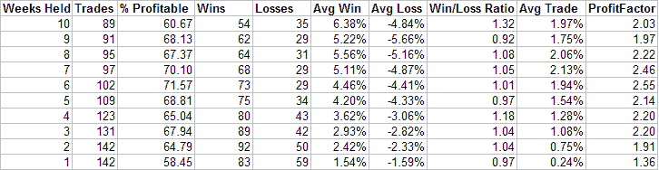

<!--yml
category: 未分类
date: 2024-05-18 08:30:39
-->

# Quantifiable Edges: Nasdaq Taking Leadership Helps Bullish Case

> 来源：[http://quantifiableedges.blogspot.com/2008/03/nasdaq-taking-leadership-helps-bullish.html#0001-01-01](http://quantifiableedges.blogspot.com/2008/03/nasdaq-taking-leadership-helps-bullish.html#0001-01-01)

A few weeks ago I posted a study which discussed the

[implications of the lagging relative strength of the Nasdaq](http://quantifiableedges.blogspot.com/2008/03/lagging-nasdaq-study-update.html)

versus the NYSE. The results of that study were strongly negative from 1-10 weeks out. Last week I noticed the Nasdaq was trying to take the lead back from the NYSE. When the market closed for the week the Nasdaq did manage to barely overtake the NYSE based on

[the indicator I’ve described in the past](http://quantifiableedges.blogspot.com/2008/02/intermediate-term-significance-of.html)

. A very astute subscriber to the

[Quantifiable Edges Subscriber Letter](http://quantifiableedges.googlepages.com/home)

also noticed this and sent me a note asking me to comment on the significance in light of my study of a few weeks ago. I’ve updated the chart from a few weeks ago below. The red line has now barely crossed the yellow line signifying the Nasdaq’s RS is slightly stronger.

I ran a few studies to determine the possible significance of the Nasdaq taking the lead. The first one simply looked to buy any time the Nasdaq went from “lagging” to “leading”. On the chart above this would be shown by the red line crossing above the yellow line. The results are below.

Overall the results were generally positive going forward. I then looked at situations like the present where the Nasdaq rebounded from an extreme lagging position as described in the previous study and then crossed over to take the lead. There were 15 such occurrences. The performance of the NYSE from 1-10 weeks out can be found in the table below.

It appears this situation is more even more favorable than a typical cross.

I then adjusted the exit criteria to change this study into more of a system. Rather than exiting “X” weeks later, I said to exit whenever the red line re-crossed below the yellow, which would represent the Nasdaq falling back to a lagging position.

Buying when the RS upward cross occurred and selling when the Nasdaq’s RS line crossed back below the NYSE would have produced 11 winning trades and 4 losers. The average winning trade was good for more than 5% and the average loser saw a decline of less than 1.2%. The length of the average winner was 7 weeks vs. 5 weeks for a loser. If $100,000 was allocated to each trade (assuming no commissions or slippage) the gross profits on winning trades would have been $50,901.45 versus gross losses of $4,617.18 for the losing trades. This equates to an outstanding profit factor (gross gains / gross losses) of 12.02.

It appears the change in the Nasdaq from “lagging” to “leading” status is another argument for the bullish case.