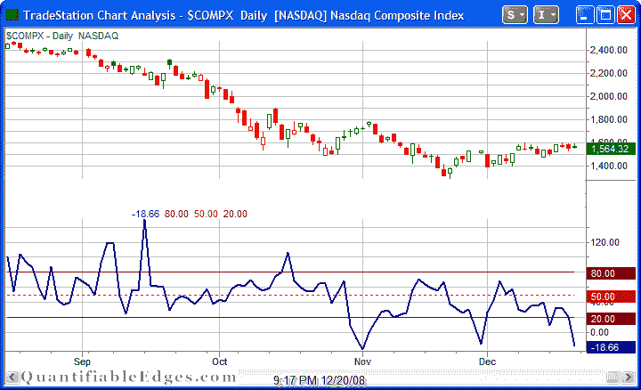

<!--yml
category: 未分类
date: 2024-05-18 13:31:29
-->

# Quantifiable Edges: Nasdaq Volume Spyx Suggesting A Short-Term Drop

> 来源：[http://quantifiableedges.blogspot.com/2008/12/nasdaq-volume-spyx-suggesting-short.html#0001-01-01](http://quantifiableedges.blogspot.com/2008/12/nasdaq-volume-spyx-suggesting-short.html#0001-01-01)

On the front page of the website I currently show the S&P 500 Volume Spyx chart every night. Subscribers also see the Nasdaq Volume Spyx chart. (More information on Quantifiable Edges Volume Spyx indicators are available

[here.](http://quantifiableedges.blogspot.com/search/label/Spyx)

)

Below is a copy of Friday’s chart. The -18.66 reading is extremely low.

Options expiration may have had something to do with the unusually low reading, but rather than try and justify it away I decided to look at other times where the Nasdaq Volume Spyx came in extremely low. I set the parameters at -5 or below to get a decent sample size:

The results above are quite bearish short-term. Especially interesting is the fact that of the 26 occurrences, every single one of them posted a close below the trigger day close within 3 trading days. If the perfect record is to hold up, the Nasdaq will have to post a close below 1564.32 by Wednesday.