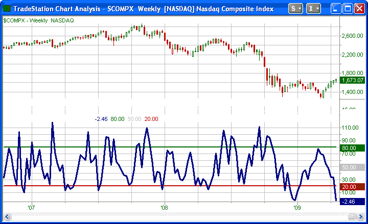
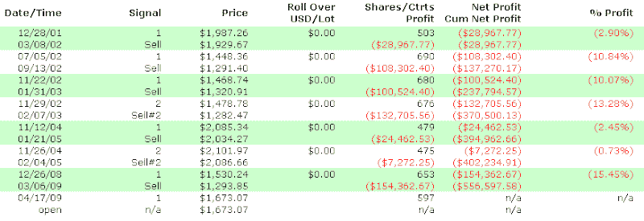
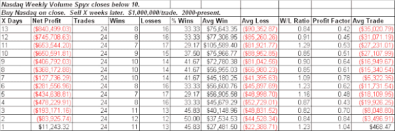

<!--yml
category: 未分类
date: 2024-05-18 13:22:45
-->

# Quantifiable Edges: Nasdaq Volume Spyx Weekly Chart Suggesting Trouble

> 来源：[http://quantifiableedges.blogspot.com/2009/04/nasdaq-volume-spyx-weekly-chart.html#0001-01-01](http://quantifiableedges.blogspot.com/2009/04/nasdaq-volume-spyx-weekly-chart.html#0001-01-01)

I’ve discussed my

[Volume Spyx](http://quantifiableedges.blogspot.com/search/label/Spyx)

indicators on the blog a fair amount. What I haven’t shown is that Spyx readings can also be useful on weekly charts. The calculations for Spyx readings are proprietary but basically it looks at volume on a relative basis across multiple securities. For the Nasdaq chart it’s looking at Nasdaq securities. As the name would imply, it looks for “spikes” in the relative volume statistics.

Over the past 2 weeks the Nasdaq Volume Spyx weekly chart has been giving readings with potentially bearish ramifications. Below is a chart of the Weekly Nasdaq Spyx as it stood on the weekend of April 17th. The chart is followed by some research from that weekend’s Subscriber Letter.

The April 17th reading was the lowest in years. I looked at other times the indicator closed below 0 and found instances to be scarce. (Data goes back to 1/1/2000.) Below are the returns over the next ¼:

Note the above table used position sizes of $1,000,000 rather than the usual $100,000\. Ten-eleven weeks out the Nasdaq was down every time. There was some slight overlap though. Below I’ve listed all occurrences along with their 10-week return.

The instances with overlap were 11/02 and 11/04

To increase the sample size, I also looked at instances where the Nasdaq Weekly Volume Spyx came in at less than 10\. Those results are below.

Even with the loosened criteria, results are still quite bearish.

I have recently added the Weekly Nasdaq Volume Spyx chart to the charts page in the members section of the website. I will soon make all the weekly readings downloadable for

[Gold Subscribers](http://www.quantifiableedges.com/gold.html)

as I do with the daily Nasdaq and S&P Spyx readings and the CBI. (

[Click here for a free 1-week trial](http://www.quantifiableedges.com/members/register.php)

.)

In my next post I’ll show the 4/24 weekly chart and some additional research associated with that. (Preview: Still below 0 and suggesting possible trouble ahead.)