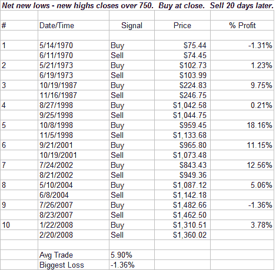
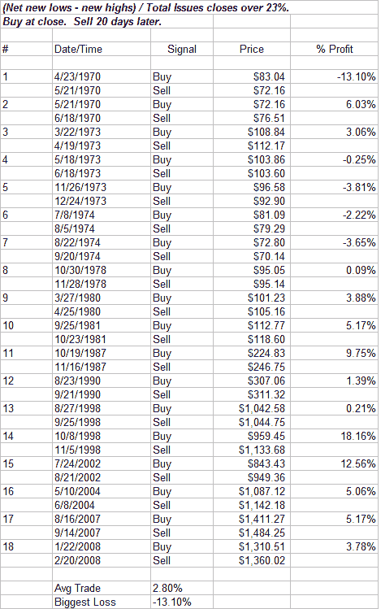

<!--yml
category: 未分类
date: 2024-05-18 08:12:29
-->

# Quantifiable Edges: Net New Lows Testing and the Need to Normalize

> 来源：[http://quantifiableedges.blogspot.com/2008/07/net-new-lows-testing-and-need-to.html#0001-01-01](http://quantifiableedges.blogspot.com/2008/07/net-new-lows-testing-and-need-to.html#0001-01-01)

One measure of breadth that reached an extreme on Friday was the number of NYSE stocks hitting new 52-week lows. Rather than just looking at 52-week lows, I typically like to look at the differential of highs and lows. As with many of the indicators I use, I believe it’s important to normalize the results when looking over long time periods. (

[Click here for a discussion on normalizing put/call ratios](http://quantifiableedges.blogspot.com/2008/06/why-you-need-to-normalize-putcall-ratio.html)

.) For this indicator the need to normalize springs from the fact that the total issues trading on the NYSE is significantly greater now than it was in the 1970’s and early 80's. Therefore I divide the raw result by the number of issues outstanding to get a percent figure. The total result on Friday was a net of 757 or just over 23% of the total issues traded on the NYSE. Here’s an example of two tests that demonstrates how results would vary greatly if you fail to adjust for the total issues trading:

Using 750 as your trigger level would give you 10 trades. Most of which are fairly recent. Now let’s use the percentage instead and see what the results look like:

18 trades instead of 10 and results are not as good as they appeared with the first test. Many more instances are found here when looking back to the 70's and 80's. By using raw numbers instead of normalizing them, you’d be missing out on almost half the pertinent data.