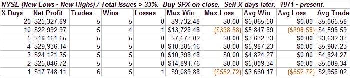
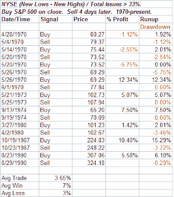

<!--yml
category: 未分类
date: 2024-05-18 08:12:13
-->

# Quantifiable Edges: New Lows In Rarified Air

> 来源：[http://quantifiableedges.blogspot.com/2008/07/new-lows-in-rarified-air.html#0001-01-01](http://quantifiableedges.blogspot.com/2008/07/new-lows-in-rarified-air.html#0001-01-01)

[The other night I discussed how I measure the % Net New Lows on the NYSE](http://quantifiableedges.blogspot.com/2008/07/net-new-lows-testing-and-need-to.html)

. Today the percent of net new lows spiked even higher. Over 1/3 of all issues hit a new 52-week low today according to my data provider. This is the first time that has happened since 1990\. Below are the results of buying this setup and holding for “X” days going back to 1971.

An average gain of 6% over the next 4 days.

But I didn’t show 1970, which wasn’t good. Below are all instances with a 4-day holding period going back to 1970, which is as far as I have the data.

Let’s hope 2008 isn’t like 1970\. I’m more than ready for a decent bounce.

*If you like the research studies like this one, try the new [Quantifiable Edges Weekend Research Letter](http://www.quantifiableedges.com/weekly.html). If you haven’t yet received a sample, just send an email to* [*weekly@quantifiableedges.com*](mailto:weekly@quantifiableedges.com) *to receive this upcoming weekend’s.*