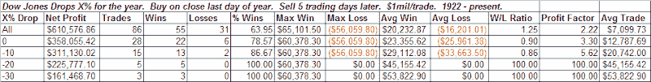

<!--yml
category: 未分类
date: 2024-05-18 13:30:51
-->

# Quantifiable Edges: New Years After Bad Years

> 来源：[http://quantifiableedges.blogspot.com/2009/01/new-years-after-bad-years.html#0001-01-01](http://quantifiableedges.blogspot.com/2009/01/new-years-after-bad-years.html#0001-01-01)

With 2008 performing so bad, I decided to see how other years started off based on the prior year’s performance. Most often the 1st week of the new year following bad years in the stock market has done quite well – and substantially better than 1st weeks coming off positive years:

