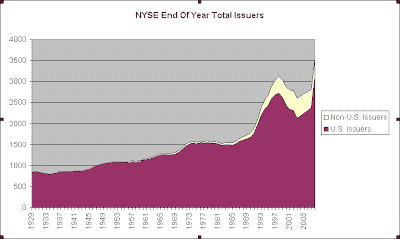

<!--yml
category: 未分类
date: 2024-05-18 13:27:38
-->

# Quantifiable Edges: Observations On NYSE Issuers 1929 - 2008

> 来源：[http://quantifiableedges.blogspot.com/2009/02/observations-on-nyse-issuers-1929-2008.html#0001-01-01](http://quantifiableedges.blogspot.com/2009/02/observations-on-nyse-issuers-1929-2008.html#0001-01-01)

A reader pointed me to the data I needed to produce a graph going back to 1929 showing the total issuers on the NYSE. The data is annual and can be located on the NYSE’s website using the following link:

[http://www.nyxdata.com/nysedata/NYSE/FactsFigures/tabid/115/Default.aspx](http://www.nyxdata.com/nysedata/NYSE/FactsFigures/tabid/115/Default.aspx "http://www.nyxdata.com/nysedata/NYSE/FactsFigures/tabid/115/Default.aspx")

(click to enlarge)

A little difficult to see is that the total issuers peaked in 1930 and declined until 1934\. The market bottomed in 1932\. The next true bull market didn’t emerge until 1942 though. (The 1942 Dow low was at 1933 levels.) Issuers crept higher for 8 years before the next great bull market environment emerged in 1942\. When that bull market emerged the pace of increase in new issuers did also – confirming the rapid economic expansion.

--

**Note that the breakout of U.S. / Non-U.S. was not available until 1956.*