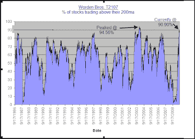

<!--yml
category: 未分类
date: 2024-05-18 13:15:10
-->

# Quantifiable Edges: Percent of Stocks Above Their 200ma's Hitting Extreme Levels

> 来源：[http://quantifiableedges.blogspot.com/2009/08/percent-of-stocks-above-their-200mas.html#0001-01-01](http://quantifiableedges.blogspot.com/2009/08/percent-of-stocks-above-their-200mas.html#0001-01-01)

Some extreme readings are appearing in a few Worden Bros. indicators that look at stocks relative to their 200 day moving averages. One is T2107, which simply looks at the percentage of stocks trading above their 200ma. The other is T2109, which looks at the percentage of stocks trading at least 1 standard deviation above their 200ma. Both indicators are near all time highs (dating back to 1986). In fact, the only period of time in which these indicators registered higher readings was in the beginning of 2004\. Below is a chart of T2107 which illustrates this:

This demonstrates just how extreme the current move is in terms of breadth. Also interesting about the chart is that we aren’t that far removed time-wise from extremely low readings. Extreme overbought doesn’t necessarily mean a decline is about to begin. In fact the last time these levels were reached in 2004, the market continued to trudge higher for about 2 ½ months before finally beginning a meaningful correction.