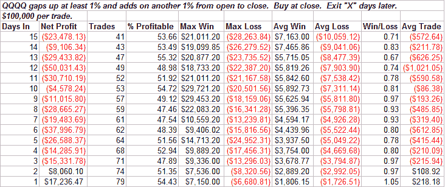
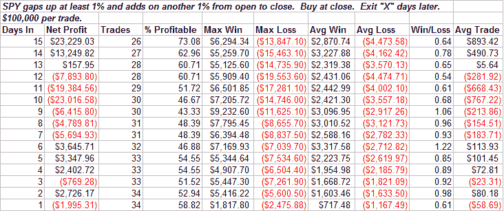

<!--yml
category: 未分类
date: 2024-05-18 08:27:19
-->

# Quantifiable Edges: Performance After A Gap And Go Day

> 来源：[http://quantifiableedges.blogspot.com/2008/04/performance-after-gap-and-go-day.html#0001-01-01](http://quantifiableedges.blogspot.com/2008/04/performance-after-gap-and-go-day.html#0001-01-01)

One test I ran tonight looked at performance following a day when the market gapped up at least 1% and then tacked on another 1% from open to close. The first table below shows the results for the QQQQ:

Results here are quite negative.

Next I looked at the SPY:

Here results were more mixed with the max loss accounting for all of the losses in most time periods.

I also looked to see how often the gap up got filled when the market was trading below its 200 day moving average. For the Nasdaq 55% of the time the gap was filled within 5 days and 74% of the time within 10 days. For the S&P the results again were not nearly as negative. Only 41% were filled within 5 days and 55% within 10 days.

A partial retracement of today’s move at some point seems likely. It may or may not be a few days before that begins, though.