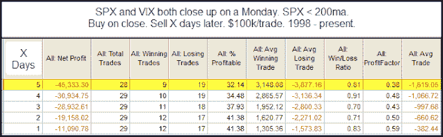

<!--yml
category: 未分类
date: 2024-05-18 08:55:49
-->

# Quantifiable Edges: Performance After SPX and VIX Both Close Higher on a Monday

> 来源：[http://quantifiableedges.blogspot.com/2011/09/perfromance-after-spx-and-vix-both.html#0001-01-01](http://quantifiableedges.blogspot.com/2011/09/perfromance-after-spx-and-vix-both.html#0001-01-01)

The SPX and the VIX typically trade counter to each other, so it's a little unusual to see them both close higher as they did yesterday. It does happen from time to time, and Monday is the most common day of the week for it to occur. This is because the VIX has a natural tendency to rise on Mondays. Even so, when it has occurred on Mondays it has typically suggested a short-term downside edge. The edge is more pronounced and lasts longer when the SPX is trading below its 200ma. Below are the numbers.

As you can see, the statistics suggest a downside edge over the next few days.