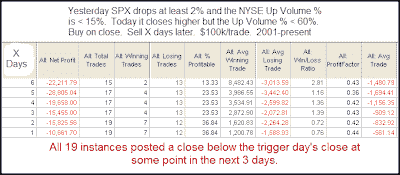

<!--yml
category: 未分类
date: 2024-05-18 13:18:44
-->

# Quantifiable Edges: Poor Rebound Breadth Not A Good Sign

> 来源：[http://quantifiableedges.blogspot.com/2009/06/poor-rebound-breadth-not-good-sign.html#0001-01-01](http://quantifiableedges.blogspot.com/2009/06/poor-rebound-breadth-not-good-sign.html#0001-01-01)

Originally published in the blog on 9/11/2008,

[the Quantifinder](http://www.quantifiableedges.com/quantifinderinfo.html)

noted the below breadth-based study for Tuesday’s close. I re-ran it in

[last night’s Subscriber Letter](http://www.quantifiableedges.com/gold.html)

and have updated it below.

*(Note: Up Volume % is tracked in the members chart area each night. It is equal to (Up volume / (Up volume + down volume).* *click table to enlarge*

The fact that there was a pullback within three days every time is a fairly compelling stat. There have been 2 upmoves occur in the 6-day holding period since I published the first set of results last September. They both had pullbacks first though, allowing either opportunity for profit or at least a chance to move your stop to breakeven. Below I’ve listed all the trades along with their 6-day exit:

Note even the 2 most recent losers saw some sizable pullbacks. The 3/6/09 instance which came very close to the bottom was the worst of the bunch from a short perspective but still moved south by over 1.5% before launching higher.