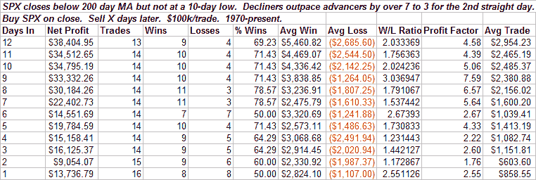

<!--yml
category: 未分类
date: 2024-05-18 13:40:59
-->

# Quantifiable Edges: Potential Bad Breadth Bounce On Tap

> 来源：[http://quantifiableedges.blogspot.com/2008/08/potential-bad-breadth-bounce-on-tap.html#0001-01-01](http://quantifiableedges.blogspot.com/2008/08/potential-bad-breadth-bounce-on-tap.html#0001-01-01)

The selloff from Monday followed through on Tuesday. For the second day in a row declining stocks outpaced advancing stocks by nearly 3:1\. Also notable is that even with 2 days of strong selling the S&P failed to close at a 10-day low. I ran these observations through the wayback machine tonight and came up with the following results:

Instances are a bit smaller than I typically like but the stats are impressive enough for me to take the study into consideration.

A few additional bits of information about the study:

1) 12 of 14 instances (85.7%) closed above the entry day close within the first week.

2) If you look out 7 trading days that improves to 13 of 14 (92.9%).

3) The average maximum gain over the next 12 days is 5.2%. The average maximum drawdown is 2.2%.

4) After 7-12 days the edge dissipates. The setup is only short-term in nature.