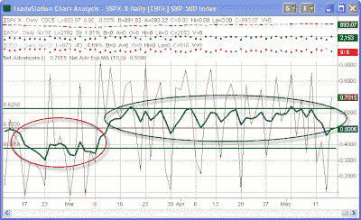

<!--yml
category: 未分类
date: 2024-05-18 13:21:27
-->

# Quantifiable Edges: Price and Breadth Weakness for the 1st Time Since March

> 来源：[http://quantifiableedges.blogspot.com/2009/05/price-and-breadth-weakness-for-1st-time.html#0001-01-01](http://quantifiableedges.blogspot.com/2009/05/price-and-breadth-weakness-for-1st-time.html#0001-01-01)

A couple of weeks ago I noted

[the weakness in the Quantifiable Edges Nasdaq Volume Spyx indicator](http://quantifiableedges.blogspot.com/2009/04/nasdaq-volume-spyx-weekly-chart.html)

that suggested the market may be nearing a multi-week pullback. While volume issued a warning, price and breadth remained strong and showed no sign of rolling over.

I’m now seeing some hints via price and breadth that there may be a change in character occurring. The uptrend appears to be weakening at the least.

Wednesday marked the 3rd lower close in a row for the S&P 500\. This is the 1st time the market has pulled back for more than 2 days since the March bottom. A move below 882.52 on Friday would mark the 5th consecutive lower low. Coming off a 50-day high that would not be a good thing. Strong markets shouldn't make 5 consecutive lower lows. That will often lead to even lower prices over the next few weeks.

One chart I show on the website is a 10-day ema of the Up Issues / ( Up Issues + Down Issues). The chart below shows the 1-day readings via the thin red line and the 10-day ema of those readings via the thick blue line. The area circled in red represents the breadth activity during the April/March selloff. As you can see, the readings were consistently below 50%.

(click chart to enlarge)

After the March bottom the 10 ema moved up sharply. Except for one day, April 30th, is has remained above the 50% line. On Wednesday that line was again breached. It did barely recover 50% on Thursday. I will be watching to see if the 50% level can hold over the next several days. Failure to do so would be another indication of a change in market character.

The market is starting to show some weakness in ways it hasn’t since the March bottom. This doesn’t necessarily mean a sharp or sustained pullback will ensue (although there are some clues that it could). It does suggest caution is warranted and traders may need to examine long positions with a more discerning eye than has been necessary in the last 2 months.