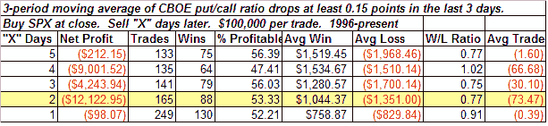

<!--yml
category: 未分类
date: 2024-05-18 08:15:52
-->

# Quantifiable Edges: Put/Call Drop

> 来源：[http://quantifiableedges.blogspot.com/2008/06/putcall-drop.html#0001-01-01](http://quantifiableedges.blogspot.com/2008/06/putcall-drop.html#0001-01-01)

After spiking a little the week before last, the CBOE Put/Call Ratio dropped fairly sharply over Wed-Fri. Below is a study I ran last night showing the implications of similar drops:

Not the most bearish study I've ever seen, but it hints that the market may struggle to add to its gains over the next 2-4 days. I'm seeing some warning signs that the going could be tough here very near-term. Caution may be warranted.

Friday also posted an "inside day". If you'd like to review possibe implications of this, you may want to check out the old

[inside days studies](http://quantifiableedges.blogspot.com/search?q=inside+days)

.