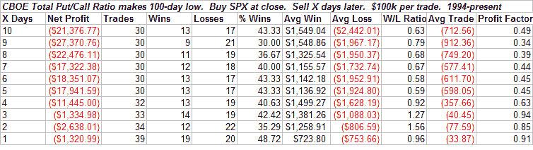

<!--yml
category: 未分类
date: 2024-05-18 13:42:12
-->

# Quantifiable Edges: Put/Call Ratio Hits 7-Month Low - What That's Meant

> 来源：[http://quantifiableedges.blogspot.com/2008/08/putcall-ratio-hits-7-month-low-what.html#0001-01-01](http://quantifiableedges.blogspot.com/2008/08/putcall-ratio-hits-7-month-low-what.html#0001-01-01)

Normally I only post one study to the blog each day. Additional work is saved for

[Subscriber Letter](http://www.quantifiableedges.com/letter.html)

recipients. But since August 6th is Independence Day in both Bolivia and Jamaica (as well as Ginger Spice’s birthday), I figured, “What the heck – let’s go for 2.”

The CBOE hit it lowest level since December 20th. That’s a quite a while. I checked to see what happened after other times it hit at least a 100-day low:

Score tonight Bears 2 – Bulls 0 (for the short-term).