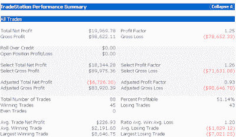
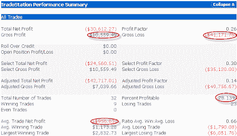
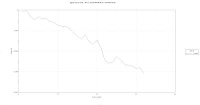
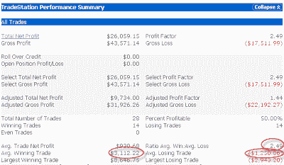

<!--yml
category: 未分类
date: 2024-05-18 13:22:53
-->

# Quantifiable Edges: Putting Large Gaps Down Into Context

> 来源：[http://quantifiableedges.blogspot.com/2009/04/putting-large-gaps-down-into-context.html#0001-01-01](http://quantifiableedges.blogspot.com/2009/04/putting-large-gaps-down-into-context.html#0001-01-01)

As I am writing this late Sunday night the S&P futures are down close to 2%. Large gaps are often seen as fading opportunities by traders. This is due to the propensity of the market to reverse gaps.

[In a study I posted to the blog a few weeks ago](http://quantifiableedges.blogspot.com/2009/04/large-gaps-after-market-has-already.html)

, I showed that the propensity of the market to either reverse or follow through on gaps up of 1% up or greater depended largely upon the action leading up to the gap. I have found a similar dependency when looking at gaps down.

Below are the results of a system that looks to purchase $100k of SPY any time it gaps lower by 1% or more and HASN’T closed higher for 2 days in a row. The trade is exited at the close of the day. As you can see, reversals are slightly favored and the net expectation is for further upside. (1998-present.)

***Click any of the images below to enlarge.***

But what about those times like now where the SPY has closed higher for 2 days in a row? Those results are below:

In this case results appear to go from somewhat bullish to strongly bearish. An overbought market that gaps down big tends to sell off further. Below is an equity curve of the system.

As you can see the downside tendency has been quite consistent.

Lastly, I also looked at gaps down following at least two down days in a row. Those results are below:

Here you see that although it’s a 50/50 proposition, the rewards outweigh the risks by a large degree. Of course since Monday’s potential gap down would be coming after two up days, the net expectation would favor more downside.

To best understand the meaning of a pattern, it often helps to take it in context. Gaps are no exception.