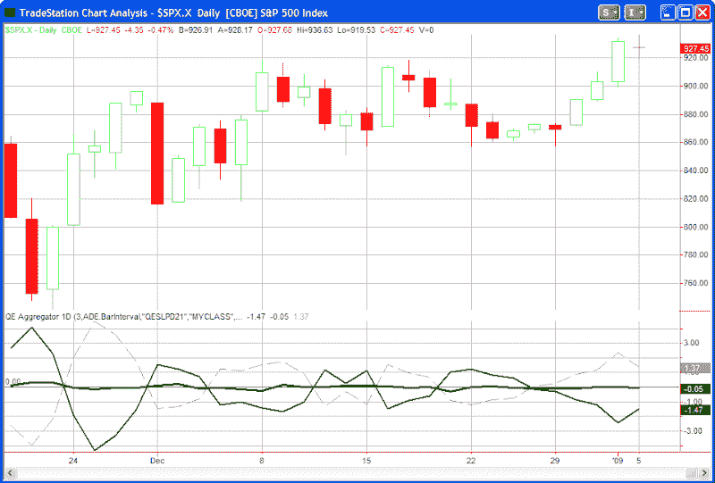

<!--yml
category: 未分类
date: 2024-05-18 13:30:33
-->

# Quantifiable Edges: Quantifiable Edges Aggregator Suggesting A Short Bias

> 来源：[http://quantifiableedges.blogspot.com/2009/01/quantifiable-edges-aggregator.html#0001-01-01](http://quantifiableedges.blogspot.com/2009/01/quantifiable-edges-aggregator.html#0001-01-01)

It’s been a long time since I’ve discussed the Quantifiable Edges Aggregator (

[click here for the July post and detailed explanation](http://quantifiableedges.blogspot.com/2008/07/quantifiable-edges-aggregator.html)

), and I’ve never posted a live chart of it to the blog, but I decided to do so today. As a quick refresher the Aggregator compiles all of the current short-term studies I have outstanding and consider “active”. Some of these studies are posted to the blog. Some only appear in the nightly or weekly subscriber letters. The Aggregator then produces a number which estimates how the studies collectively suggest the market will perform over the next few days. This is represented by the green line in the chart below.

The dashed line shows the average return of the S&P over the last few (in this case 3) days. The solid black line I refer to as the Differential line. It subtracts recent performance from recent expectations. When the Differential is negative it indicates the market has outperformed expectations over the last few days. A positive Differential indicates the market has underperformed expectations over the last few days.

As of last night’s close the green Aggregator was slightly below 0 and the black Differential line was squarely below 0\. This means that the studies are indicating a slightly bearish bias over the next few days while the market has outperformed expectations over the last few days and is overbought. This is a configuration I will typically look for to enter short trades. A configuration to enter long trades would see both the green and black lines above 0\. It’s important to note that the Aggregator is not a mechanical system. It is simply a graphical representation of my studies vs. the S&P 500.

For a free trial to the

[Quantifiable Edges members area](http://www.quantifiableedges.com/meminfo.html)

and to see how I incorporate the Aggregator in my analysis simply

[click here](http://www.quantifiableedges.com/members/register.php)

.