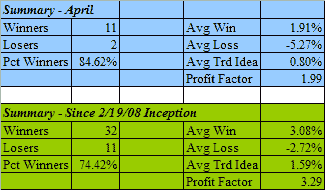

<!--yml
category: 未分类
date: 2024-05-18 08:18:30
-->

# Quantifiable Edges: Quantifiable Edges Subscriber Letter April Results

> 来源：[http://quantifiableedges.blogspot.com/2008/05/quantifiable-edges-subscriber-letter.html#0001-01-01](http://quantifiableedges.blogspot.com/2008/05/quantifiable-edges-subscriber-letter.html#0001-01-01)

I’ve presented below the summary results of the

[Quantifiable Edges Subscriber Letter](http://www.quantifiableedges.com/letter.html)

trade ideas for April and since inception. April was a decent month. Although there were fewer trade ideas and rewards were a bit smaller than March, it was still strongly positive.

In addition to the trade ideas, the Subscriber Letter provides additional research beyond the blog and shows CBI analysis down to the sector level. More features will be announced soon. Should anyone wish to receive a free three-day trial to the Quantifiable Edges Subscriber Letter, just send an email to

[QuantEdges@HannaCapital.com](mailto:QuantEdges@HannaCapital.com)

and include your name and email address.