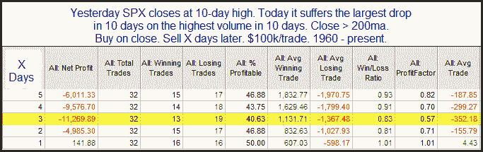

<!--yml
category: 未分类
date: 2024-05-18 13:02:14
-->

# Quantifiable Edges: Relatively Strong Drops From Highs

> 来源：[http://quantifiableedges.blogspot.com/2010/04/relatively-strong-drops-from-highs.html#0001-01-01](http://quantifiableedges.blogspot.com/2010/04/relatively-strong-drops-from-highs.html#0001-01-01)

Last night the Quantifinder identified a study that looked at relatively strong drops from highs when the market was in a long-term uptrend. That study last appeared in the 1/19/10 Subscriber Letter. I’ve updated the results table below:

This isn’t the most high-powered edge we’ve seen but it does provided a subtle hint that there may be a bearish edge present over the next few days. I also filtered the results a few different ways, such as using a 50-day high or a 200-day high. No matter how I sliced it results remained fairly similar to these.