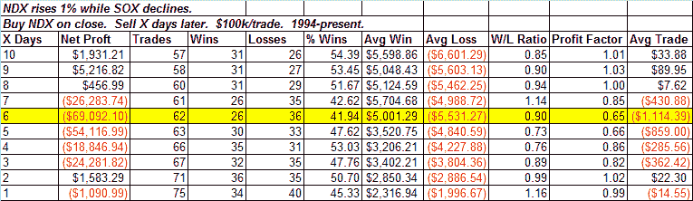

<!--yml
category: 未分类
date: 2024-05-18 13:30:16
-->

# Quantifiable Edges: SOX Drop Could Be Negative For NDX

> 来源：[http://quantifiableedges.blogspot.com/2009/01/sox-drop-could-be-negative-for-ndx.html#0001-01-01](http://quantifiableedges.blogspot.com/2009/01/sox-drop-could-be-negative-for-ndx.html#0001-01-01)

One bit of action I did find notable today was that the Nasdaq 100 gained over 1%, but the SOX closed lower on the day. It’s quite unusual for the NDX to put in such a strong performance without some help from the SOX. Historically this has had slightly bearish short-term implications for the NDX:

