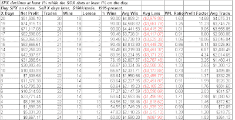

<!--yml
category: 未分类
date: 2024-05-18 13:20:38
-->

# Quantifiable Edges: SOX Strength A Potential Bullish Sign

> 来源：[http://quantifiableedges.blogspot.com/2009/05/sox-strength-potential-bullish-sign.html#0001-01-01](http://quantifiableedges.blogspot.com/2009/05/sox-strength-potential-bullish-sign.html#0001-01-01)

I’ve discussed a few times in the past that when the SOX rises in the face of a selloff it is often a good thing. In the 8/13/08 blog I looked at performance following times wherer the SPX dropped 1% and the SOX rose on the day. Below is a slight twist on that study that looks at returns following an SPX drop of 1% with an SOX rise of 1%.

(click table to enlarge)

Three to four weeks out you’re looking at 90% winners. The average S&P gain over the next 4 weeks was over 4%. Even the instances over the last year were followed by positive numbers over the next 3 weeks or so. They were 7/15/08 (+5.75% over the next 15 trading days), 8/7/08 (+2.73%), 12/9/08 (+1.64%), and 2/25/09 (+3.85%). Meanwhile, if you bought the leading SOX instead of the SPX the average 4-week trade across the entire sample set rose from 4% to 8.2%.

Score one for the bulls. (Although I’m still seeing several bearish studies as well.)