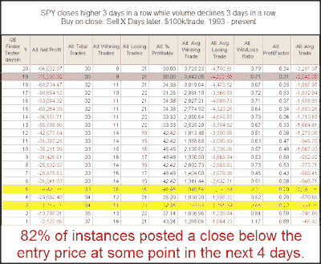

<!--yml
category: 未分类
date: 2024-05-18 13:14:11
-->

# Quantifiable Edges: SPY Rising While SPY Volume Declines

> 来源：[http://quantifiableedges.blogspot.com/2009/09/spy-rising-while-spy-volume-declines.html#0001-01-01](http://quantifiableedges.blogspot.com/2009/09/spy-rising-while-spy-volume-declines.html#0001-01-01)

In

[May of 2008 I showed](http://quantifiableedges.blogspot.com/2008/05/volume-pattern-that-makes-huge.html)

how 3 higher closes in the SPX (while under to 200ma) had different implications depending on the volume pattern. Tuesday we had this 3-higher closes pattern appear in the SPY while SPY volume declined all three days. This is a slightly different twist and one worth examining:

(click table to enlarge)

This setup appears especially bearish over the 1st week. Possible bearish implications extend out much further than just a week, though.

Would you like to be made aware any time this setup triggers in the future?

[The Quantifinder](http://quantifiableedges.blogspot.com/2009/05/quantifinder-unveiled.html)

does it for you! Versions of the Quantifinder are available with both

[gold](http://www.quantifiableedges.com/gold.html)

and

[silver](http://www.quantifiableedges.com/silver.html)

subscriptions.

As I ready to publish this I see that Cobra also noticed this pattern last night.

[Check out his take](http://cobrasmarketview.blogspot.com/2009/09/09082009-market-recap-last-resistance.html)

as he identifies several recent occurrences on his chart.