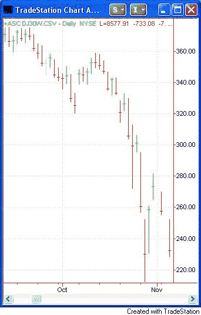
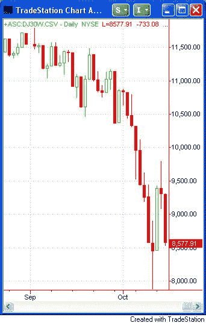
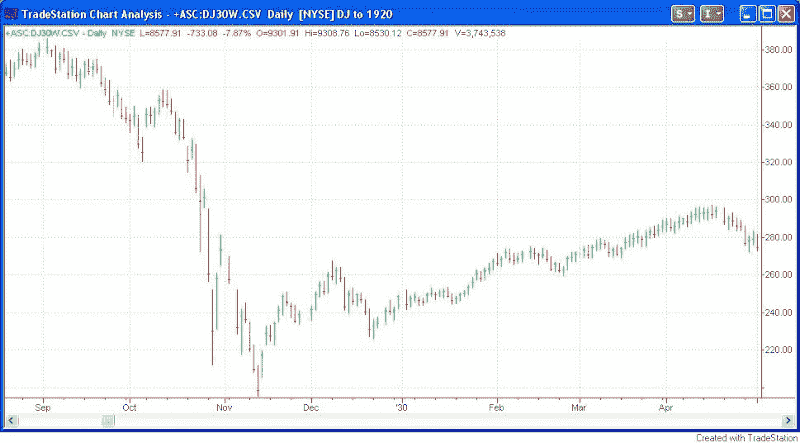
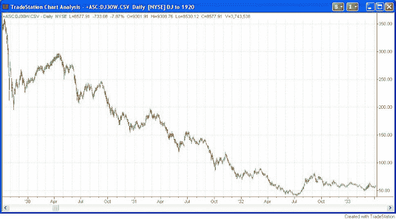

<!--yml
category: 未分类
date: 2024-05-18 13:36:12
-->

# Quantifiable Edges: Scary Pictures

> 来源：[http://quantifiableedges.blogspot.com/2008/10/scary-pictures.html#0001-01-01](http://quantifiableedges.blogspot.com/2008/10/scary-pictures.html#0001-01-01)

Here’s a chart of the Dow Jones:

Here’s another chart of the Dow Jones:

The 1st one is 1929\. The 2nd one is 2008.

They sure look a lot alike to me.

On Wednesday the S&P dropped 9%. It was the 3rd time in less than a month that it dropped over 7.5%. Since my S&P data only goes back to 1960, I checked out the Dow to see if it had ever dropped 7.5% 3 times in one month. It had. Once. In the 1929 picture you see above. While history never plays out exactly the same I’m sure everyone is wondering how the current picture resolved itself in 1929\. Was the initial crash low broken?

Answer: Yes. The current period compares to the beginning of November in the 1929 chart. There was one final leg down before a sizable rally ensued that lasted well into 1930.

Of course if we zoom out a bit more…

This is not a quantitative study. It is not a commentary on the state of the economy or the action of the government. It is definitely not a prediction. But if you thought there was no way it could get much worse from a long-term standpoint…well…it could.